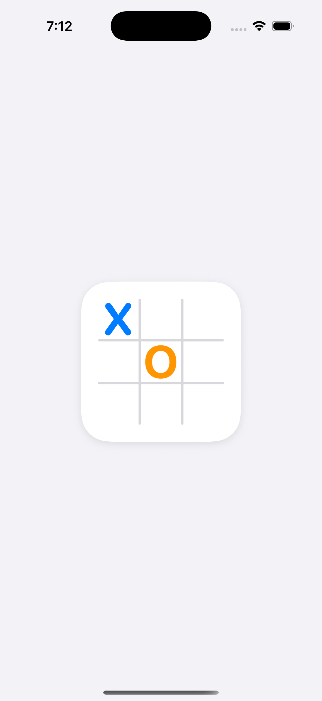
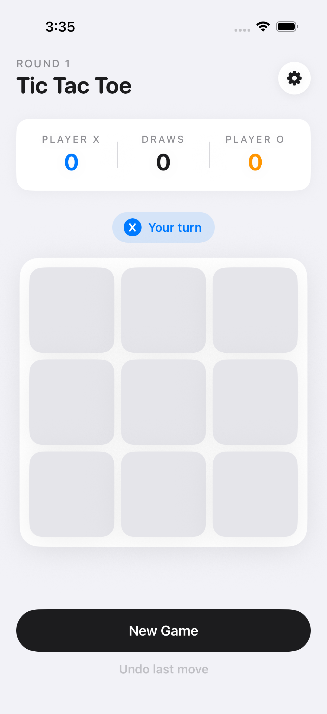
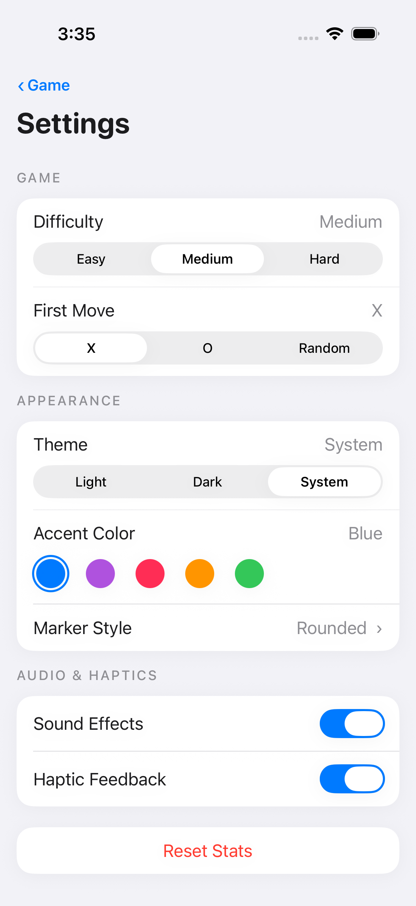

# Tic Tac Toe

A SwiftUI tic-tac-toe iOS app with configurable themes, accent colors, marker styles, first-move preference, and three AI difficulties.

Bundle id: `com.test.TicTacToeGame` · Display name: **Tic Tac Toe** · iOS deployment target: **26.4** · Universal (iPhone + iPad).

> The Xcode project, schemes, and folders are still named `FigmaDemo` / `FigmaDemoKit` — only the product's user-facing name and bundle identifier are renamed.

## Screenshots

| Splash | Home | Settings |
| --- | --- | --- |
|  |  |  |

Captured on iPhone 17 Pro (iOS 26.4).

## Requirements

- macOS with Xcode 26 (Swift 6.0 tools, Swift 5.0 language mode for the app target)
- iOS 26.4 simulator or device
- `xcode-select -p` must point at a full Xcode install (not Command Line Tools) to run `xcodebuild`

## Getting started

Open `FigmaDemo.xcodeproj` in Xcode, pick the **FigmaDemo** scheme and an iOS 26.4 destination, then ⌘R.

From the shell:

```bash
xcodebuild -project FigmaDemo.xcodeproj -scheme FigmaDemo \
  -destination 'platform=iOS Simulator,name=iPhone 17,OS=26.4.1' build
```

## Tests

Package targets use **Swift Testing**; the app's UI tests use **XCTest**.

```bash
# All package tests (AppPreferences, GameDomain, DesignSystem, UIComponents,
# GameFeature, SettingsFeature)
swift test --package-path FigmaDemoKit

# App + UI tests
xcodebuild -project FigmaDemo.xcodeproj -scheme FigmaDemo \
  -destination 'platform=iOS Simulator,name=iPhone 17,OS=26.4.1' test
```

## Architecture

The app target is thin — it owns an `AppPreferences` and a `GameViewModel`, then drives a `NavigationStack` between `GameScreen` and `SettingsScreen`. Everything else lives in the local SwiftPM package `FigmaDemoKit/`:

| Module | Role |
| --- | --- |
| `AppPreferences` | `@Observable` typed wrapper over `UserDefaults` (theme, accent, marker style, first move, difficulty) |
| `GameDomain` | Pure model + rules: `Board`, `GameState`, `GameEngine`, plus `AIOpponent` with `RandomAI` / `BlockOrWinAI` / `ForkAwareAI` |
| `DesignSystem` | Token primitives (`DSColor`, `DSFont`, `DSRadius`, `DSShadow`, `DSSpacing`) and `Theming` |
| `UIComponents` | Reusable SwiftUI views (board, scoreboard, settings rows, pickers, buttons) |
| `GameFeature` | `GameScreen`, `GameViewModel`, `AIOpponentFactory` — owns the AI move loop |
| `SettingsFeature` | `SettingsScreen`, `SettingsViewModel` |

See `CLAUDE.md` for deeper notes on layering and conventions.

### Brand assets

The app icon (light / dark / tinted) and the static launch logo are PNGs rendered by a small Swift CLI under `Tools/AssetGen/`. To regenerate after a palette or composition change:

```bash
swift run --package-path Tools/AssetGen AssetGen
```

Outputs land in `FigmaDemo/Assets.xcassets/AppIcon.appiconset/` and `…/LaunchLogo.imageset/`. The launch logo is intentionally rendered without the X/O marks — the SwiftUI `BrandSplashView` shown on app start animates them in over an otherwise-identical card.
